# Microsoft Entra ID Identity Lab

Hands-on identity administration in Microsoft Entra ID (formerly Azure Active Directory), covering the account tasks an IT help desk handles every day: creating users, managing group access, resetting passwords, offboarding a leaver, delegating limited admin rights, and reviewing the audit trail.

This is the cloud counterpart to my on-premises [Active Directory home lab](https://github.com/byzhs/active-directory-home-lab). The same departments and group names are used in both, so the two can be compared directly. The users are fictional lab accounts.

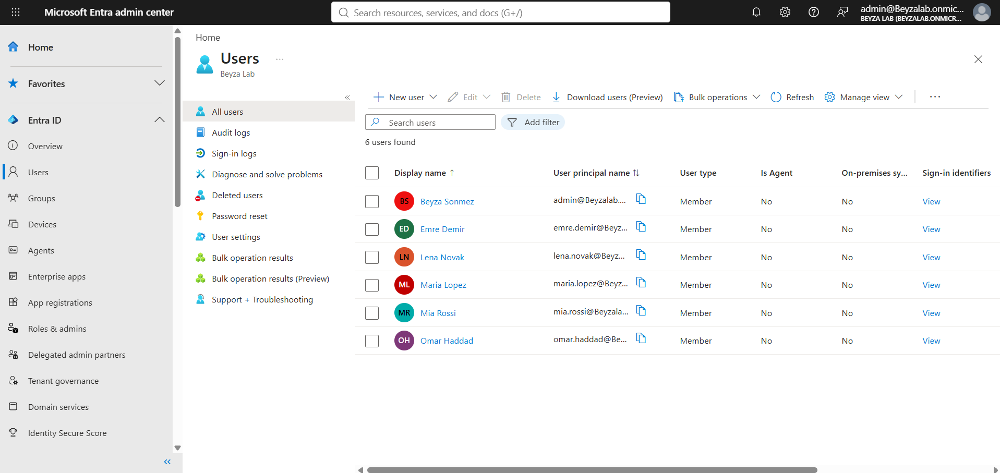

## Environment

- Microsoft Entra ID tenant (Entra ID Free), administered as Global Administrator
- Microsoft Entra admin center
- Security defaults enabled (multi-factor authentication baseline)

## What I did

| # | Task | Result |
| --- | --- | --- |
| 1 | Created user accounts with department, job title and usage location | Six users across HR, Sales, Finance and IT |
| 2 | Created security groups and assigned members | GRP-HR, GRP-Sales, GRP-Finance |
| 3 | Reset a user's password as an administrator | Temporary password issued |
| 4 | Verified the reset by signing in as the user | Forced password change at first sign-in |
| 5 | Offboarded a leaver | Sign-in blocked, sessions revoked, group access removed |
| 6 | Delegated help desk rights using least privilege | Helpdesk Administrator role assigned |
| 7 | Confirmed the multi-factor authentication baseline | Security defaults enabled |
| 8 | Reviewed the audit log | Every change recorded with time and target |

## Walkthrough

### Users and groups
Accounts are organized by department, and access is granted through security groups, not to individuals.

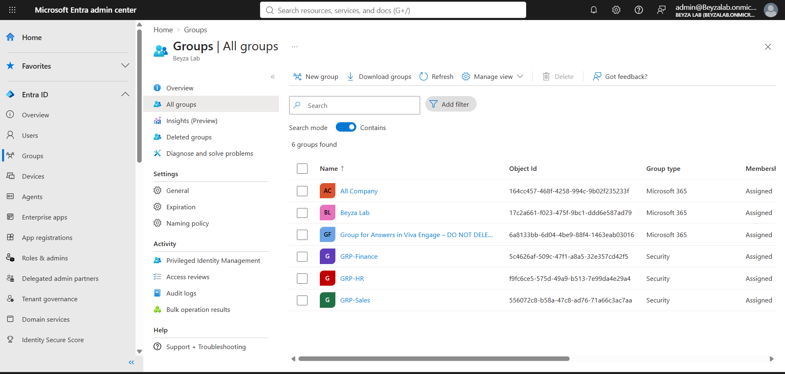
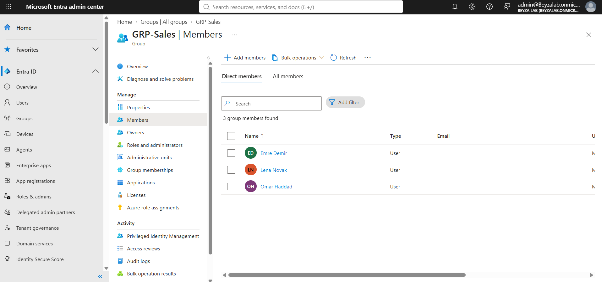

### Password reset
An administrator reset issues a temporary password. The user must replace it the first time they sign in, so the help desk never knows the user's real password.

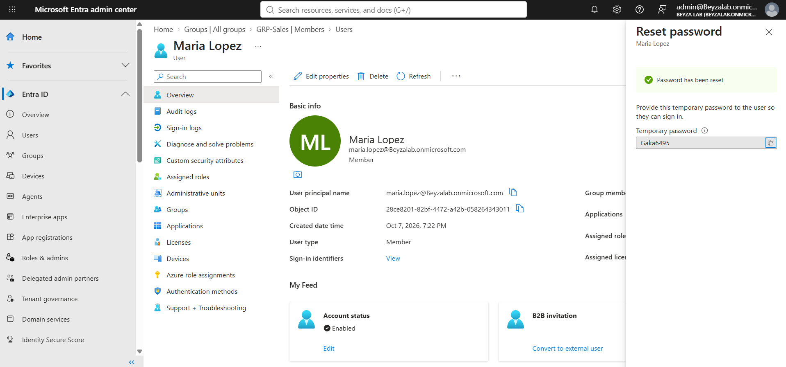
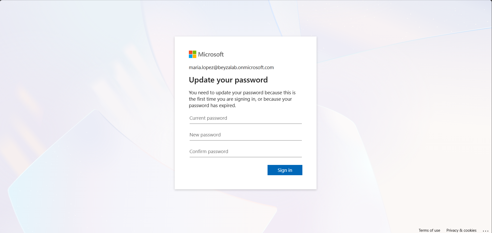
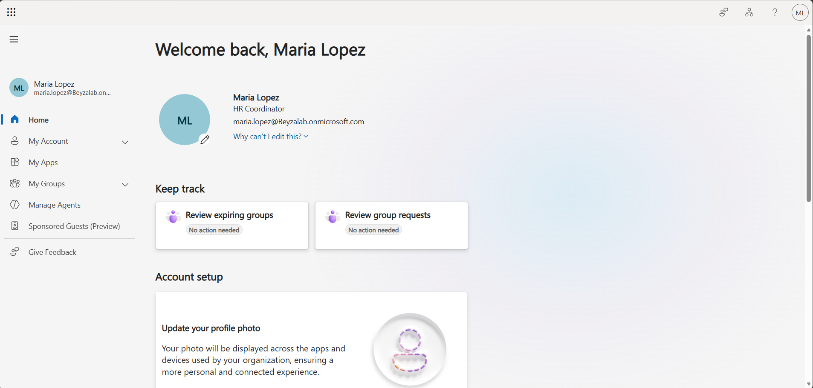

### Offboarding a leaver
The account is disabled, active sessions are revoked, and group membership is removed. The account is disabled, not deleted, so data and history are kept.

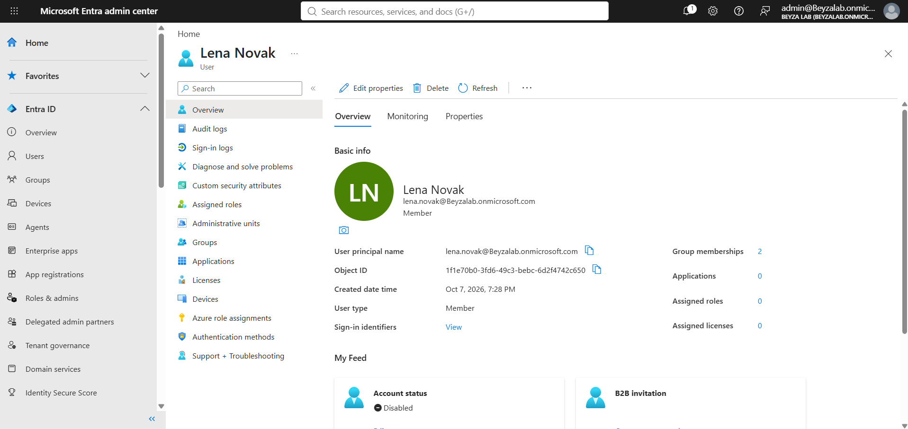
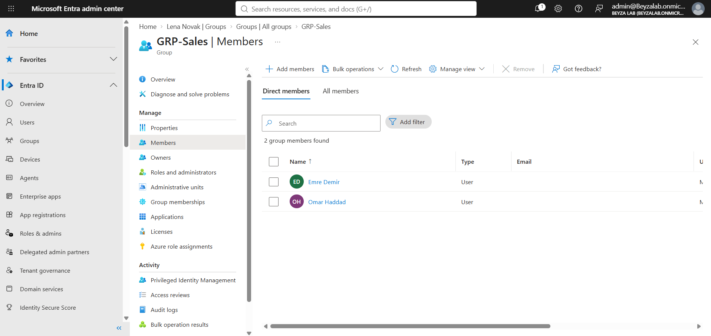

### Least privilege
The IT support account holds the Helpdesk Administrator role, which can reset passwords for non-administrators but cannot change tenant settings or other admins.

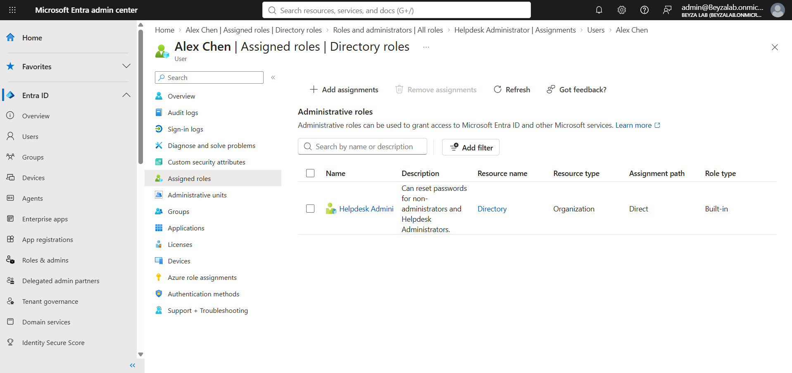

### Security baseline and audit trail
Security defaults require multi-factor authentication registration for all users. The audit log records each administrative action.

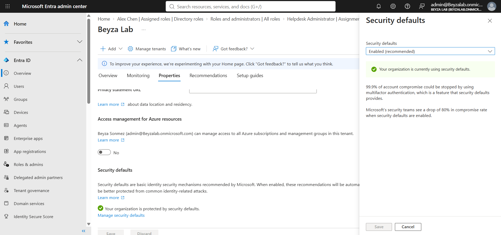
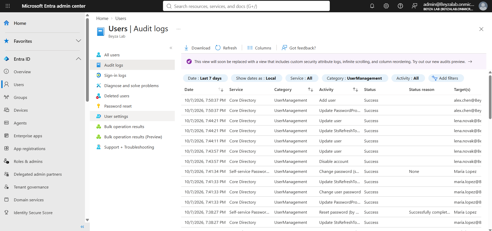

## What I learned

- **On-premises and cloud identity follow the same model.** Users, groups and group-based access work the same way in Active Directory and Entra ID; the tools and sign-in flow are different.
- **Blocking sign-in is not enough for a leaver.** Existing sessions stay valid until they are revoked.
- **Least privilege is practical.** A help desk role can do its job without Global Administrator rights.
- **Audit logs make changes accountable.** Each action shows who did it, when, and to which account.

## Tools

Microsoft Entra admin center, Microsoft Entra ID, security groups, built-in directory roles, security defaults, audit logs
